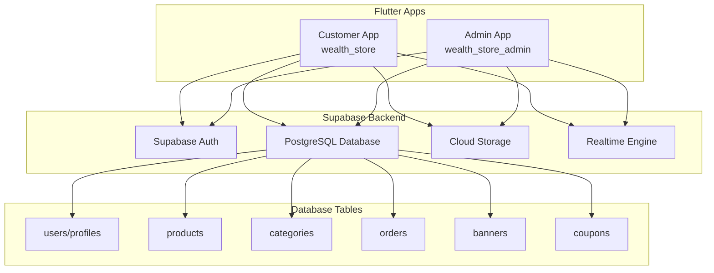

# Supabase Integration Design Document

## Overview

This design document outlines the comprehensive integration of both Customer App (wealth_store) and Admin App (wealth_store_admin) with Supabase backend services. The integration will provide authentication, database management, real-time syncing, and cloud storage capabilities while ensuring role-based access control for admin functionality.

## Architecture

### High-Level Architecture



### Service Layer Architecture

Both apps will follow a clean architecture pattern with:
- **Services Layer**: Supabase client wrappers
- **Repository Layer**: Data access abstraction
- **State Management**: Riverpod providers
- **UI Layer**: Flutter widgets with hooks

## Components and Interfaces

### 1. Supabase Configuration Service

**Purpose**: Centralized Supabase initialization and configuration

```dart
class SupabaseConfig {
  static const String supabaseUrl = 'https://zazbfusupfoxdhfgqmno.supabase.co';
  static const String supabaseAnonKey = 'eyJhbGciOiJIUzI1NiIsInR5cCI6IkpXVCJ9...';
  
  static Future<void> initialize() async {
    await Supabase.initialize(
      url: supabaseUrl,
      anonKey: supabaseAnonKey,
    );
  }
}
```

### 2. Authentication Service

**Purpose**: Handle user authentication with role-based access

```dart
class AuthService {
  final SupabaseClient _client = Supabase.instance.client;
  
  Future<AuthResponse> signIn(String email, String password);
  Future<AuthResponse> signUp(String email, String password);
  Future<void> resetPassword(String email);
  Future<void> updatePassword(String newPassword);
  Future<bool> isAdmin();
  Future<void> signOut();
}
```

### 3. Database Services

**Purpose**: CRUD operations for each entity

#### Product Service
```dart
class ProductService {
  Future<List<Product>> getProducts({int? limit, int? offset, String? categoryId});
  Future<Product> createProduct(Product product);
  Future<Product> updateProduct(String id, Product product);
  Future<void> deleteProduct(String id);
}
```

#### Category Service
```dart
class CategoryService {
  Future<List<Category>> getCategories();
  Future<Category> createCategory(Category category);
  Future<Category> updateCategory(String id, Category category);
  Future<void> deleteCategory(String id);
}
```

#### Order Service
```dart
class OrderService {
  Future<List<Order>> getOrders({String? status, String? userId});
  Future<Order> createOrder(Order order);
  Future<Order> updateOrderStatus(String id, String status);
}
```

#### Banner Service
```dart
class BannerService {
  Future<List<Banner>> getBanners({bool? isActive});
  Future<Banner> createBanner(Banner banner);
  Future<Banner> updateBanner(String id, Banner banner);
  Future<void> deleteBanner(String id);
}
```

#### Coupon Service
```dart
class CouponService {
  Future<List<Coupon>> getCoupons({bool? isActive});
  Future<Coupon> createCoupon(Coupon coupon);
  Future<Coupon> updateCoupon(String id, Coupon coupon);
  Future<void> deleteCoupon(String id);
}
```

### 4. Storage Service

**Purpose**: File upload/download and management

```dart
class StorageService {
  Future<String> uploadFile(String bucket, String path, File file);
  Future<String> uploadBinary(String bucket, String path, Uint8List data);
  Future<Uint8List> downloadFile(String bucket, String path);
  Future<void> deleteFile(String bucket, String path);
  Future<List<FileObject>> listFiles(String bucket, {String? folder});
}
```

### 5. Real-time Service

**Purpose**: Handle real-time data synchronization

```dart
class RealtimeService {
  Stream<List<Product>> watchProducts();
  Stream<List<Category>> watchCategories();
  Stream<List<Order>> watchOrders();
  Stream<List<Banner>> watchBanners();
  Stream<List<Coupon>> watchCoupons();
}
```

## Data Models

### Database Schema

#### Users/Profiles Table
```sql
CREATE TABLE profiles (
  id UUID PRIMARY KEY REFERENCES auth.users(id),
  updated_at TIMESTAMP DEFAULT NOW(),
  username TEXT UNIQUE,
  full_name TEXT,
  avatar_url TEXT,
  role TEXT DEFAULT 'customer' CHECK (role IN ('admin', 'manager', 'customer')),
  is_active BOOLEAN DEFAULT TRUE
);
```

#### Products Table
```sql
CREATE TABLE products (
  id UUID PRIMARY KEY DEFAULT gen_random_uuid(),
  name TEXT NOT NULL,
  description TEXT,
  price DECIMAL(10,2) NOT NULL,
  category_id UUID REFERENCES categories(id),
  image_urls TEXT[],
  stock_quantity INTEGER DEFAULT 0,
  is_active BOOLEAN DEFAULT TRUE,
  created_at TIMESTAMP DEFAULT NOW(),
  updated_at TIMESTAMP DEFAULT NOW()
);
```

#### Categories Table
```sql
CREATE TABLE categories (
  id UUID PRIMARY KEY DEFAULT gen_random_uuid(),
  name TEXT NOT NULL UNIQUE,
  description TEXT,
  image_url TEXT,
  is_active BOOLEAN DEFAULT TRUE,
  created_at TIMESTAMP DEFAULT NOW()
);
```

#### Orders Table
```sql
CREATE TABLE orders (
  id UUID PRIMARY KEY DEFAULT gen_random_uuid(),
  user_id UUID REFERENCES auth.users(id),
  total_amount DECIMAL(10,2) NOT NULL,
  status TEXT DEFAULT 'pending' CHECK (status IN ('pending', 'confirmed', 'shipped', 'delivered', 'cancelled')),
  shipping_address JSONB,
  order_items JSONB,
  created_at TIMESTAMP DEFAULT NOW(),
  updated_at TIMESTAMP DEFAULT NOW()
);
```

#### Banners Table
```sql
CREATE TABLE banners (
  id UUID PRIMARY KEY DEFAULT gen_random_uuid(),
  title TEXT NOT NULL,
  description TEXT,
  image_url TEXT NOT NULL,
  link_url TEXT,
  is_active BOOLEAN DEFAULT TRUE,
  display_order INTEGER DEFAULT 0,
  created_at TIMESTAMP DEFAULT NOW()
);
```

#### Coupons Table
```sql
CREATE TABLE coupons (
  id UUID PRIMARY KEY DEFAULT gen_random_uuid(),
  code TEXT NOT NULL UNIQUE,
  description TEXT,
  discount_type TEXT CHECK (discount_type IN ('percentage', 'fixed')),
  discount_value DECIMAL(10,2) NOT NULL,
  min_order_amount DECIMAL(10,2),
  max_uses INTEGER,
  current_uses INTEGER DEFAULT 0,
  expires_at TIMESTAMP,
  is_active BOOLEAN DEFAULT TRUE,
  created_at TIMESTAMP DEFAULT NOW()
);
```

### Flutter Data Models

```dart
@freezed
class Product with _$Product {
  const factory Product({
    required String id,
    required String name,
    String? description,
    required double price,
    String? categoryId,
    @Default([]) List<String> imageUrls,
    @Default(0) int stockQuantity,
    @Default(true) bool isActive,
    DateTime? createdAt,
    DateTime? updatedAt,
  }) = _Product;
  
  factory Product.fromJson(Map<String, dynamic> json) => _$ProductFromJson(json);
}
```

## Error Handling

### Error Types and Handling Strategy

1. **Network Errors**: Retry mechanism with exponential backoff
2. **Authentication Errors**: Redirect to login screen
3. **Authorization Errors**: Show access denied message
4. **Validation Errors**: Display field-specific error messages
5. **Server Errors**: Show generic error message with retry option

```dart
class AppException implements Exception {
  final String message;
  final String? code;
  final dynamic originalError;
  
  AppException(this.message, {this.code, this.originalError});
}

class ErrorHandler {
  static AppException handleSupabaseError(dynamic error) {
    if (error is AuthException) {
      return AppException('Authentication failed: ${error.message}');
    } else if (error is PostgrestException) {
      return AppException('Database error: ${error.message}');
    } else if (error is StorageException) {
      return AppException('Storage error: ${error.message}');
    }
    return AppException('An unexpected error occurred');
  }
}
```

## Testing Strategy

### Unit Testing
- Service layer methods
- Data model serialization/deserialization
- Business logic functions
- Error handling scenarios

### Integration Testing
- Supabase connection and authentication
- CRUD operations for each entity
- File upload/download functionality
- Real-time data synchronization

### Widget Testing
- Admin dashboard CRUD interfaces
- Customer app product display
- Authentication flows
- Error state handling

### End-to-End Testing
- Complete user journeys (customer purchase flow)
- Admin management workflows
- Cross-app data synchronization

## Security Considerations

### Row Level Security (RLS) Policies

```sql
-- Products: Everyone can read, only admins can modify
CREATE POLICY "Products are viewable by everyone" ON products FOR SELECT USING (true);
CREATE POLICY "Only admins can insert products" ON products FOR INSERT WITH CHECK (auth.jwt() ->> 'role' = 'admin');
CREATE POLICY "Only admins can update products" ON products FOR UPDATE USING (auth.jwt() ->> 'role' = 'admin');
CREATE POLICY "Only admins can delete products" ON products FOR DELETE USING (auth.jwt() ->> 'role' = 'admin');

-- Orders: Users can see their own orders, admins can see all
CREATE POLICY "Users can view own orders" ON orders FOR SELECT USING (auth.uid() = user_id OR auth.jwt() ->> 'role' = 'admin');
CREATE POLICY "Users can create own orders" ON orders FOR INSERT WITH CHECK (auth.uid() = user_id);
CREATE POLICY "Only admins can update orders" ON orders FOR UPDATE USING (auth.jwt() ->> 'role' = 'admin');
```

### Storage Security
- Bucket policies for image uploads
- File size and type restrictions
- Authenticated access for sensitive files

## Performance Optimization

### Caching Strategy
- Image caching with `cached_network_image`
- API response caching with TTL
- Local storage for frequently accessed data

### Pagination
- Implement cursor-based pagination for large datasets
- Lazy loading for product lists
- Infinite scroll for better UX

### Real-time Optimization
- Selective real-time subscriptions
- Debounced updates to prevent excessive re-renders
- Connection management for battery optimization

## Deployment Configuration

### Environment Variables
```dart
class Environment {
  static const String supabaseUrl = String.fromEnvironment('SUPABASE_URL');
  static const String supabaseAnonKey = String.fromEnvironment('SUPABASE_ANON_KEY');
  static const bool isDevelopment = bool.fromEnvironment('IS_DEVELOPMENT', defaultValue: false);
}
```

### Build Configuration
- Separate configurations for development, staging, and production
- Environment-specific Supabase projects
- Feature flags for gradual rollout