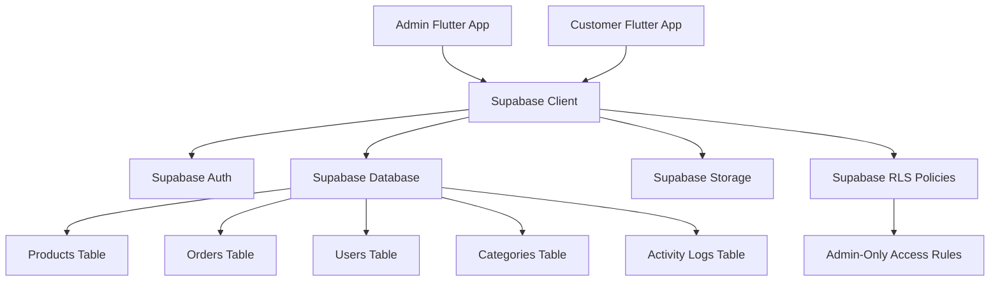

# Design Document

## Overview

The admin panel (`wealth_store_admin`) is a Flutter web application that provides comprehensive administrative control over the eCommerce system. The design follows a clean, modern interface with a sidebar navigation, metric cards, data tables, and visual charts. The application uses a shared Supabase backend with the customer app while maintaining strict role-based access control.

## Architecture

### High-Level Architecture



### Application Architecture

The admin app follows a feature-based architecture with clear separation of concerns:

- **Presentation Layer**: Flutter widgets and screens
- **Business Logic Layer**: Riverpod providers and state management
- **Data Layer**: Supabase services and repositories
- **Security Layer**: Authentication and authorization middleware

## Components and Interfaces

### 1. Authentication System

#### Login Screen Design
- Clean, centered login form with the "T" logo
- Email and password input fields with modern styling
- "Remember Me" checkbox and "Forgot Password" link
- Blue primary button for "Sign In"
- Minimalist design matching the reference UI

#### Authentication Flow
```dart
class AuthService {
  Future<AuthResponse> signInAdmin(String email, String password);
  Future<void> signOut();
  Future<bool> isAdminUser(String userId);
  Stream<AuthState> get authStateChanges;
}
```

### 2. Navigation System

#### Sidebar Navigation
- Fixed left sidebar with menu items
- Icons and labels for each section:
  - Dashboard (home icon)
  - Media (image icon)
  - Products (box icon)
  - Categories (grid icon)
  - Brands (tag icon)
  - Customers (users icon)
  - Orders (shopping cart icon)
  - Coupons (ticket icon)
  - Settings (gear icon)
  - Logout (exit icon)

#### Top Navigation Bar
- Global search functionality
- User profile dropdown
- Notification bell icon
- Breadcrumb navigation

### 3. Dashboard Components

#### Metric Cards
Four main metric cards displaying:
- **Sales Total**: $34,945.76 with percentage change
- **Average Order Value**: $1,543.44 with trend indicator
- **Total Orders**: 522 with growth percentage
- **Visitors**: 25,035 with comparison data

#### Charts and Analytics
- **Weekly Sales Chart**: Vertical bar chart showing daily sales data
- **Orders Status Chart**: Donut chart with color-coded segments:
  - Processing (blue)
  - Shipping (orange)
  - Delivered (green)
  - Cancelled (red)

#### Recent Orders Table
- Order ID, Date, Items, Status, Amount columns
- Status badges with appropriate colors
- Pagination controls

### 4. Product Management System

#### Product List Interface
- Data table with columns:
  - Product image thumbnail
  - Product name
  - Stock quantity
  - Brand
  - Price range
  - Date added
  - Action buttons (edit/delete)
- "Add Product" button (blue, top-left)
- Search functionality
- Pagination with "Rows per page" selector

#### Product Form Design
```dart
class ProductFormData {
  String name;
  String description;
  double price;
  int stock;
  String categoryId;
  String brandId;
  List<String> imageUrls;
  Map<String, dynamic> specifications;
}
```

### 5. Media Management System

#### File Upload Interface
- Drag-and-drop area with folder icon
- "Upload Images" button (blue, top-right)
- Gallery/Folders toggle
- Grid view for uploaded images
- File organization by folders

### 6. Data Models

#### Core Models
```dart
class Product {
  final String id;
  final String name;
  final String description;
  final double price;
  final int stock;
  final String categoryId;
  final String brandId;
  final List<String> imageUrls;
  final DateTime createdAt;
  final DateTime updatedAt;
}

class Order {
  final String id;
  final String userId;
  final List<OrderItem> items;
  final double totalAmount;
  final OrderStatus status;
  final DateTime createdAt;
}

class AdminUser {
  final String id;
  final String email;
  final String role;
  final DateTime lastLogin;
}

class DashboardMetrics {
  final double salesTotal;
  final double averageOrderValue;
  final int totalOrders;
  final int visitors;
  final Map<String, double> weeklySales;
  final Map<OrderStatus, int> orderStatusCounts;
}
```

## User Interface Design System

### Color Palette
- **Primary Blue**: #4F46E5 (buttons, active states)
- **Background**: #F8FAFC (main background)
- **Card Background**: #FFFFFF
- **Text Primary**: #1F2937
- **Text Secondary**: #6B7280
- **Success**: #10B981
- **Warning**: #F59E0B
- **Error**: #EF4444

### Typography
- **Headers**: Inter, 24px, Bold
- **Subheaders**: Inter, 18px, Semibold
- **Body Text**: Inter, 14px, Regular
- **Captions**: Inter, 12px, Regular

### Component Styling
- **Cards**: White background, subtle shadow, 8px border radius
- **Buttons**: 8px border radius, medium padding
- **Input Fields**: Border with focus states, 6px border radius
- **Tables**: Alternating row colors, hover states

## Error Handling

### Authentication Errors
- Invalid credentials: Clear error message below login form
- Network errors: Retry mechanism with user feedback
- Session expiry: Automatic redirect to login with notification

### Data Operation Errors
- Failed uploads: Progress indicator with error states
- Network timeouts: Retry buttons and offline indicators
- Validation errors: Inline field validation with red text

### Error Logging
```dart
class ErrorLogger {
  static void logError(String operation, dynamic error, StackTrace stackTrace);
  static void logUserAction(String userId, String action, Map<String, dynamic> details);
}
```

## Testing Strategy

### Unit Testing
- Service layer testing for all Supabase operations
- State management testing for Riverpod providers
- Model validation and serialization testing

### Widget Testing
- Form validation and submission flows
- Navigation and routing behavior
- Chart and data visualization components

### Integration Testing
- End-to-end authentication flows
- CRUD operations for all entities
- File upload and image management

### Security Testing
- Role-based access control verification
- SQL injection prevention testing
- File upload security validation

## Performance Considerations

### Data Loading
- Implement pagination for large datasets
- Use lazy loading for images and charts
- Cache frequently accessed data

### Image Optimization
- Compress images before upload
- Generate thumbnails for product images
- Implement progressive image loading

### State Management
- Use Riverpod for efficient state updates
- Implement proper disposal of resources
- Optimize rebuild cycles for complex widgets

## Security Implementation

### Authentication Security
```dart
class AuthMiddleware {
  static Future<bool> requireAdminRole(String userId) async {
    final user = await supabase.from('users').select('role').eq('id', userId).single();
    return user['role'] == 'admin';
  }
}
```

### Row Level Security Policies
```sql
-- Products table - Admin only access
CREATE POLICY "Admin read access" ON products
FOR SELECT USING (
  auth.uid() IN (
    SELECT id FROM users WHERE role = 'admin'
  )
);

-- Orders table - Admin only access
CREATE POLICY "Admin orders access" ON orders
FOR ALL USING (
  auth.uid() IN (
    SELECT id FROM users WHERE role = 'admin'
  )
);
```

### File Upload Security
- Validate file types and sizes
- Scan uploaded files for malware
- Implement secure file naming conventions
- Use signed URLs for temporary access

## Responsive Design

### Breakpoints
- **Desktop**: 1200px and above (primary target)
- **Tablet**: 768px - 1199px (secondary support)
- **Mobile**: Below 768px (basic support)

### Layout Adaptations
- Collapsible sidebar on smaller screens
- Responsive data tables with horizontal scroll
- Stack metric cards vertically on mobile
- Adjust chart sizes for different screen sizes

## API Integration

### Supabase Service Layer
```dart
class SupabaseService {
  // Products
  Future<List<Product>> getProducts({int page = 1, int limit = 20});
  Future<Product> createProduct(ProductFormData data);
  Future<Product> updateProduct(String id, ProductFormData data);
  Future<void> deleteProduct(String id);
  
  // Orders
  Future<List<Order>> getOrders({OrderStatus? status, DateTime? startDate});
  Future<Order> updateOrderStatus(String orderId, OrderStatus status);
  
  // Analytics
  Future<DashboardMetrics> getDashboardMetrics();
  Future<Map<String, dynamic>> getAnalyticsData(DateRange range);
  
  // File Management
  Future<String> uploadImage(File file, String bucket);
  Future<void> deleteImage(String url);
}
```

### Real-time Updates
- Subscribe to order status changes
- Real-time dashboard metric updates
- Live notification system for admin actions

## Deployment Considerations

### Build Configuration
- Separate environment configurations for development/production
- Optimize bundle size for web deployment
- Configure proper caching strategies

### Environment Variables
```dart
class AppConfig {
  static const String supabaseUrl = String.fromEnvironment('SUPABASE_URL');
  static const String supabaseAnonKey = String.fromEnvironment('SUPABASE_ANON_KEY');
  static const String environment = String.fromEnvironment('ENVIRONMENT');
}
```

This design provides a comprehensive foundation for building a modern, secure, and user-friendly admin panel that matches the provided UI/UX specifications while maintaining scalability and maintainability.